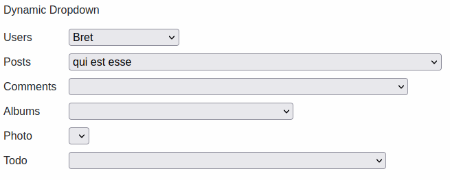

# Table of Contents <!-- omit in toc -->
- [Dynamic Forms](#dynamic-forms)
  - [What is it and what can I do with it](#what-is-it-and-what-can-i-do-with-it)
    - [Progressive filtering](#progressive-filtering)
    - [Automatic fields initialisation with dynamic content](#automatic-fields-initialisation-with-dynamic-content)
    - [Visibility changes depending on fields' state](#visibility-changes-depending-on-fields-state)
    - [Updating rules](#updating-rules)
    - [Much much more](#much-much-more)
  - [Documentation, installation and examples of use](#documentation-installation-and-examples-of-use)
  - [Main features](#main-features)
  - [Support](#support)

# Dynamic Forms

## What is it and what can I do with it
DynamicForms is a client library that handles all the interaction in forms with dynamic content in an easy and fast way.

It was born to automate progressive filtering and initialisation of dynamic fields. Then it evolved to support the developer in managing and centralizing all forms interactions.

It's written in *typescript* and compiled in *javascript*. It is later transpiled with *webpack* and *babel* to create a single lightweight bundle which ensure the maximum compatibility with older browsers.

Here's some examples.

### Progressive filtering

### Automatic fields initialisation with dynamic content

The progressive filtering status is restored: all the available options are automatically fetched.

### Visibility changes depending on fields' state

### Updating rules

### Much much more
Got your attention? Try it!

Dynamic Forms is released as a **single file**. You can also find an already functioning example!

## Documentation, installation and examples of use
See [**DynamicForms page**](https://simomosi.github.io/dynamic-forms/).

## Main features
- [x] **Easy to use**: DynamicForms works in a declarative way; no code with the default behavior, just a simple configuration!
- [x] **Modern javascript and backward compatible**: works on all browsers!
- [x] **Lightweight**: having no dependencies, you can integrate it everywhere!
- [x] **Automate repetitive and boring operations**: read values, fetch data making async remote calls, update fields' status, clear other fields, hide/show sections... even listing them is BORING!
- [x] **Highly customizable**: are you using an external library with custom html elements? Don't worry as you can specify your own functions to read/write data

## Support
If you want to support me just star the project on [github](https://github.com/simomosi/dynamic-forms) and share it with your collegues. If you have questions or suggestions open an issue on github.

**Thank you very much for your support ❤**
