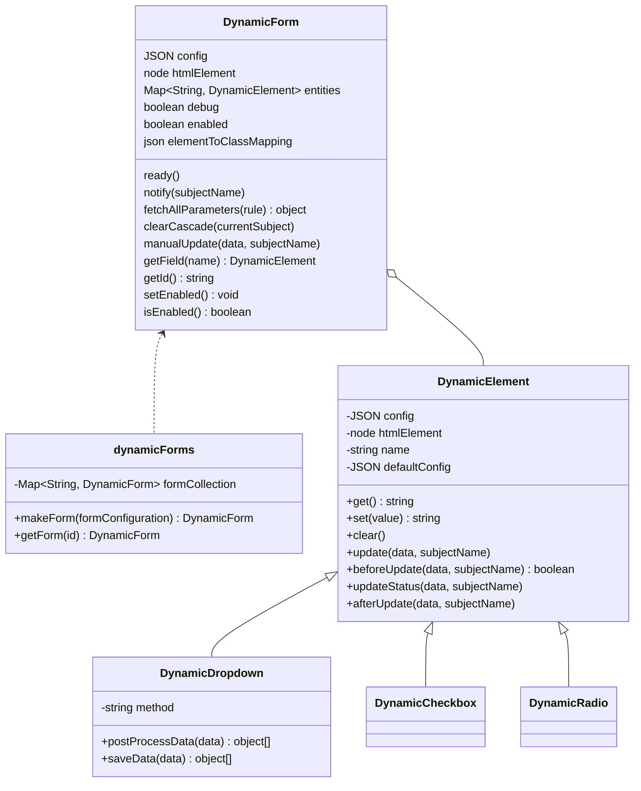

# Dynamic Forms


## What is it and what can I do with it
DynamicForms is a javascript library that handles all the interaction in forms with dynamic content in an easy and fast way.

Here's some examples.

### Select with variable options

{ loading=lazy }

### Form values easy initialisation


### Visibility changes depending on fields' state

{ loading=lazy }

### Updating rules

{ loading=lazy }

### Much much more
Got your attention? Try it!

Dynamic Forms is released as a **single file**. You can also find an already functioning example!

## Main features
- [x] **Easy to use**: DynamicForms works in a declarative way; no code, just a simple configuration!
- [x] **Simple and modern javascript**: having no dependencies, you can integrate it everywhere!
- [x] **Automate repetitive and boring operations**: read values, fetch data making async remote calls, update fields' status, clear other fields, hide/show sections... even listing them is BORING!
- [x] **Highly customizable**: are you using an external library with custom html elements? Don't worry: you can specify your own functions to read/write data

## Installation
### Package manager

=== "npm"
    ```shell
    npm i @simomosi/dynamic-forms
    ```
=== "Yarn"
    ```shell
    yarn add @simomosi/dynamic-forms
    ```

This will put the library under `*node_modules/@simomosi/dynamic-forms/dist/dynamicforms.min.js*`

### Local
Download the last release from [GitHub release section](https://github.com/simomosi/dynamic-forms/releases). Extracts files in your assets folder and load them in your project (see section below).

This is not the recommended method because you can't get updates automatically.

If you still want to proceed this way, it is recommended to use the minified file (*dynamicforms.min.js*) for better performance.

## Load the library
Choose your favorite import method

=== "Script tag"
    ```html
    <script src = 'your-assets-path/@simomosi/dynamic-forms/dist/dynamicforms.min.js'></script>
    ```

=== "ES6 Module"
    ```html
    <script type="module">
        import * from 'your-assets-path/@simomosi/dynamic-forms/dist/dynamicforms.min.js';
    </script>
    ```
=== "Commonjs require"
    ```javascript
    const dynamicForms = require('@simomosi/dynamic-forms');
    ```

## Documentation
### Examples of use

- [Minimal and serverless working example](./examples/minimal-example.md) (you can copy and paste it!)

### Configuration

- [DynamicForms module](./dynamic-forms-module.md) (how to use the library)
- [Form configuration](./configurations/form-configuration.md) (identify the form and define its behavior)
- [Field configuration](./configurations/field-configuration.md) (identify form fields and define their behavior)

## Cool computer science stuff
- DynamicForms is a particular instance of the **Observer Design Pattern** in which Observers and Subjects are all of the same type: html elements
- The function used to clear fields *on cascade* is the **Depth-first search (DFS)** used in Graph theory
- The library entry point (*src/index.js*) implements the **Facade Design Pattern** to improve software usability: it masks more complex underlying code e.g. explicit objects instantiation

## Disclaimer
DynamicForms is build considered some use-cases I faced in my career.

If you can offer me other *real* use cases to test it on please let me know.

If you have trouble using it open an issue, I'll be glad to help you. Suggestions are also welcome!

It will be useful if you pass me some code to try: you can use tools like CodePen, PasteBin etc.

## Contribute
Help me develop DynamicForms!

Remember to work on `dist/dynamicforms.js` file to access source code (or import the `src/index.js` file as a module if you prefer).

Useful commands:

- `yarn build:dev` - Build the project in *development mode*: this enables dev tools and keeps references to original source code; you can use it with `--watch` flag
- `yarn build:prod` - Build the project in *production mode*: this improves performance and security (hide all source code references); you can use it with `--watch` flag
- `yarn build` - Build both dev file and prod file
- `yarn build:diagrams` - Updates *classdiagram.svg* from *classdiagram.mmd*

Please, update also the documentation if you can.

Here is the UML Class Diagram to help you understand the project structure.

<!--  -->
<!-- TODO: remove from assets if gh-deploy is ok -->



**Thank you very much for your support ❤**

## ToDo List

- Use dynamic-forms with dynamically created fields
