# Dynamic Forms

## What is it and what can I do with it
DynamicForms is a javascript library that handles all the interaction in forms with dynamic content in an easy and fast way.

Here's some examples.

### Select with variable options

### Visibility changes depending on fields' state

### Updating rules

### Much much more
Got your attention? Try it!

Dynamic Forms is released as a **single file**. You can also find an already functioning example!

## Main features
- **Easy to use**: DynamicForms works in a declarative way; no code, just a simple configuration!
- **Simple and modern javascript**: having no dependencies, you can integrate it everywhere!
- **Automatize repetitive and boring operations**: read values, fetch data making async remote calls, update fields' status, clear other fields, hide/show sections...
- **Highly customizable**: are you using an external library with custom html elements? Don't worry: you can specify your own functions to read/write data

## Installation
### NPM/Yarn
Feature incoming, stay tuned!

### Local
Include *dist/dynamicforms.js* in your project.

## Documentation and examples of use
- [Minimal and serverless working example](./examples/minimal-example.md) (you can copy and paste it!)
- [DynamicForms module](./dynamic-forms-module.md) (how to use the library)
- [Form configuration](./configurations/form-configuration.md) (identify the form and define its behavior)
- [Field configuration](./configurations/field-configuration.md) (identify form fields and define their behavior)

## Cool computer science stuff
- DynamicForms is a particular instance of the **Observer Design Pattern** in which Observers and Subjects are all of the same type: html elements
- The function used to clear fields *on cascade* is the **Depth-first search (DFS)** used in Graph theory
- The library entry point (*src/index.js*) implements the **Facade Design Pattern** to improve software usability: it masks more complex underlying code e.g. explicit objects instantiation

## Contribute
Help me develop DynamicForms!

Useful commands:
- `yarn build-dev` - Build the project in development mode: this enables dev tools and keeps references to original source code;
- `yarn build-prod` - Build the project in production mode: this improves performance and security (hide all source code references).

First of all, build the library with my `yarn build-dev` script. Now you can work on project sources.

Please, update also the documentation if you can.

Here is the UML Class Diagram to help you understand the project structure.

**Thank you very much for your support ❤**
