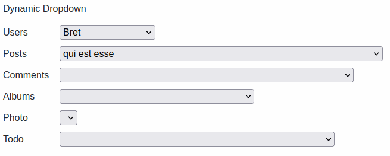

# Dynamic Forms

## What is it and what can I do with it
DynamicForms is a javascript library that handles all the interaction in forms with dynamic content in an easy and fast way.

Here's some examples.

### Select with variable options

{ loading=lazy }

### Form values easy initialisation

{ loading=lazy }

### Visibility changes depending on fields' state

{ loading=lazy }

### Updating rules

{ loading=lazy }

### Much much more
Got your attention? Try it!

Dynamic Forms is released as a **single file**. You can also find an already functioning example!

## Main features
- [x] **Easy to use**: DynamicForms works in a declarative way; no code, just a simple configuration!
- [x] **Simple and modern javascript**: having no dependencies, you can integrate it everywhere!
- [x] **Automate repetitive and boring operations**: read values, fetch data making async remote calls, update fields' status, clear other fields, hide/show sections... even listing them is BORING!
- [x] **Highly customizable**: are you using an external library with custom html elements? Don't worry: you can specify your own functions to read/write data

## Support
If you want to support me just star the project on [github](https://github.com/simomosi/dynamic-forms): I'm not looking for fame, I need to pass a threshold to put dynamic-forms on famous cdn sites and make it even easier to integrate!

**Thank you very much for your support ❤**
