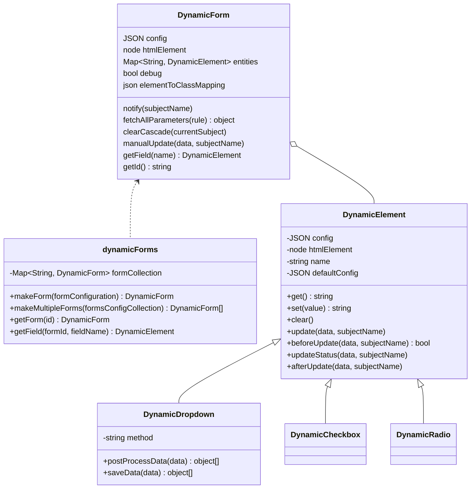

```mermaid
classDiagram

    class DynamicForm {
        JSON config
        node htmlElement
        Map~String, DynamicElement~ entities
        bool debug
        json elementToClassMapping

        notify(subjectName)
        fetchAllParameters(rule) object
        clearCascade(currentSubject)
        manualUpdate(data, subjectName)
        getField(name) DynamicElement
        getId() string
    }

    class dynamicForms {
        -Map~String, DynamicForm~ formCollection
        +makeForm(formConfiguration) DynamicForm
        +makeMultipleForms(formsConfigCollection) DynamicForm[]
        +getForm(id) DynamicForm
        +getField(formId, fieldName) DynamicElement
    }

    class DynamicElement {
        -JSON config
        -node htmlElement
        -string name
        -JSON defaultConfig
        +get() string
        +set(value) string
        +clear()
        +update(data, subjectName)
        +beforeUpdate(data, subjectName) bool
        +updateStatus(data, subjectName)
        +afterUpdate(data, subjectName)
    }

    class DynamicDropdown {
        -string method
        +postProcessData(data) object[]
        +saveData(data) object[]
    }

    DynamicForm <.. dynamicForms
    DynamicForm o-- DynamicElement
    DynamicElement <|-- DynamicDropdown
    DynamicElement <|-- DynamicCheckbox
    DynamicElement <|-- DynamicRadio
```
