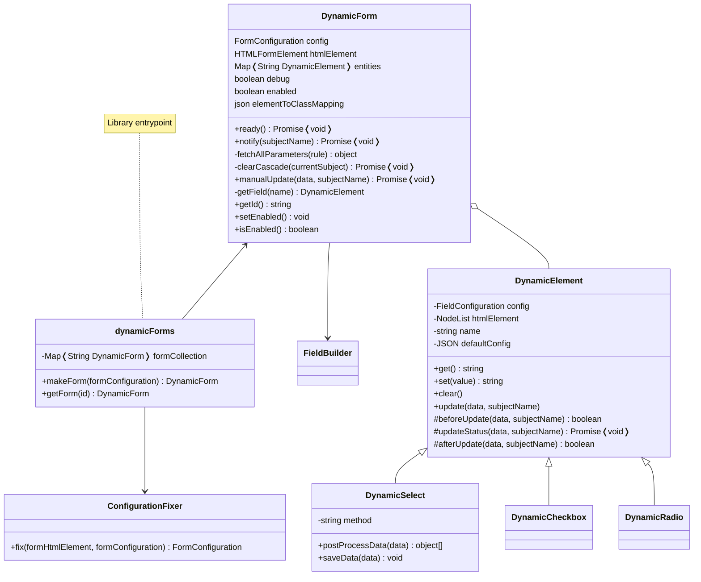

# Contribute
Help me develop DynamicForms!

Remember to work on `dist/dynamicforms.js` file to access source code (or import the `src/index.js` file as a module if you prefer).

Useful commands:

- `yarn build:dev` - Build the project in *development mode*: this enables dev tools and keeps references to original source code; you can use it with `--watch` flag
- `yarn build:prod` - Build the project in *production mode*: this improves performance and security (hide all source code references); you can use it with `--watch` flag
- `yarn build` - Build both dev file and prod file
- `yarn build:diagrams` - Updates *classdiagram.svg* from *classdiagram.mmd* <!-- TODO remove if gh-deploy succeeds -->

Please, update also the documentation if you can.

**Thank you very much for your support ❤**

## Disclaimer
DynamicForms is build considered some use-cases I faced in my career.

If you can offer me other *real* use cases to test it on please let me know.

## Issues/Suggestions
If you have trouble using it open an issue, I'll be glad to help you. Suggestions are also welcome!

It will be useful if you pass me some code to try: you can use tools like CodePen, PasteBin etc.

# Project Structure
Here is the UML Class Diagram to help you understand the project structure.

<!--  -->
<!-- TODO: remove from assets if gh-deploy succeeds -->

