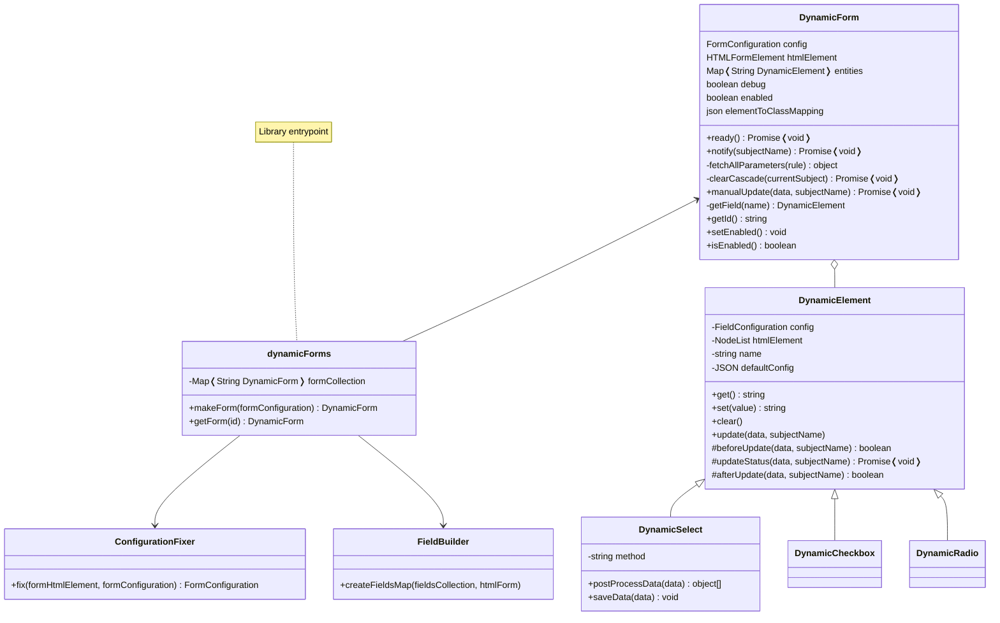

# Contribute
Help me develop DynamicForms!

Remember to work on `src/*.ts` files and test them building the bundle and importing `dist/dynamicforms.js` (of course you can import individual files manually if you prefer so).

Useful commands:

- `yarn build:dev` - Build the project in *development mode*: this enables dev tools and keeps references to original source code; you can use it with `--watch` flag
- `yarn build:prod` - Build the project in *production mode*: this improves performance and security (hide all source code references); you can use it with `--watch` flag
- `yarn build` - Build both dev file and prod file
- `yarn build:diagrams` - Updates *classdiagram.svg* from *classdiagram.mmd* <!-- TODO remove if gh-deploy succeeds -->

Please, update also the documentation if you change anything.

**Thank you very much for your support ❤**

## Disclaimer
DynamicForms is build considered some use-cases I faced in my career.

It is a very generic library but there may be other use cases which I didn't account for. In this case please let me know, we can work together in implementing new features.

## Issues/Suggestions
If you have trouble using DynamicForms open an issue, I'll be glad to help you. Suggestions are also welcome!

It will be useful if you pass me some code to try: you can use tools like CodePen, PasteBin etc.

# Project Structure
Here is the UML Class Diagram to help you understand the project structure. Types are not specified for space reasons: the diagram is created using Mermaid which places elements automatically.

<!--  -->
<!-- TODO: remove from assets if gh-deploy succeeds -->

